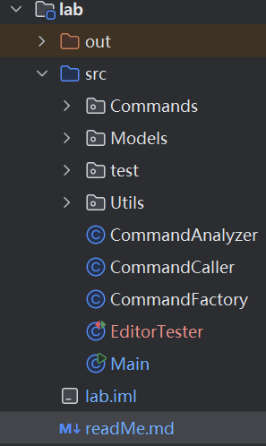

# HTML编辑器简介

很高兴和大家共同完成高级软件这门课的PJ，首先对目前的demo做一个简单的介绍

## 1. 模块简介，

作为demo，目前进行了简单的HTML预定义以及初始化指令的编写，包含

1. Main: 调用所有工具进行会话工作
2. CommandAnalyzer: 对输入指令进行初步合法性和状态判断，过滤不合法指令以及未初始化的情况
3. CommandCaller: 根据输入生成对应指令名+参数，调用简单工厂生成命令并执行
4. CommandFactory: 根据指令名生成对应指令模型
5. Commands: 抽象命令接口及各指令的实现
6. Models: 对指令实现进行封装
7. Utils: HTML对象的抽象定义、简单操作；HTML缓冲区

## 2. 编写注意事项
1. 目前已完成init指令的编写，各命令基于HTML缓冲区共享HTML内容
2. HTML缓冲区基于单例模式，各命令使用getInstance()方法获取HTML实例，保证唯一性。
3. 编辑器启动时，缓冲区为一个id为”empty"的HtmlElement；可以使用方法getHtmlContent()用于获取缓冲区内容。
4. 为了体现设计模式，实现基础指令需要新建对应的Commands类、Models类，并在CommandFactory中进行调用就可接入系统

## 3. 关于测试
测试的类是EditorTester
由于测试进程无法访问编辑器进程的存储空间，目前采用的交互方式是由编辑器进程输出缓冲区内容，在测试类完成判断
如果运行不成功可能是因为路径问题,ProcessBuilder默认是从工作目录下面拼接路径，如我的工作路径是Lab1/lab
所以我的编译文件夹out放在lab文件夹下




## 4. 关于Undo/Redo命令的说明

由于`Command`接口中只定义了`excute()`方法而没有定义`undo()`方法，因此本项目使用基于快照（Snapshot）的方式实现了撤销和重做功能。主要通过以下几个核心组件实现：

### 1. 状态历史管理器（`HtmlHistory`）

```java
public class HtmlHistory {
    private static HtmlHistory instance;
    private Stack<HtmlElement> undoStack;
    private Stack<HtmlElement> redoStack;

	// ....省略具体实现
    }

```

- 使用两个栈分别存储撤销历史（undoStack）和重做历史（redoStack）
- 采用单例模式确保全局唯一的历史记录
- 通过深拷贝（deepClone）确保状态快照的独立性


### 2. 状态保存装饰器（StateSavingCommandDecorator）

```java
public class StateSavingCommandDecorator implements Command {
    private final Command command;

    public StateSavingCommandDecorator(Command command) {
        this.command = command;
    }

    @Override
    public void execute() {
        // 保存状态用于撤销
        HtmlHistory.getInstance().saveState();

        command.execute();
    }
}

```

- 使用装饰器模式为命令添加状态保存功能
- 在命令执行前保存当前状态
- 自动清理重做栈，确保命令执行后的状态一致性


### 3. 修改命令工厂（CommandFactory）

```java
public class CommandFactory {
    public static Command createCommand(String commandType, String[] commandArgs) {
        switch (commandType) {
            case "init":
                return new InitModel();
            case "undo":
                return new UndoCommand();
            case "redo":
                return new RedoCommand();
            case "test":
                return new StateSavingCommandDecorator(new TestCommand(commandArgs));
            default:
                return null;
        }
    }
}
```

- 使用工厂模式创建命令对象
- **为需要保存状态的命令添加装饰器**